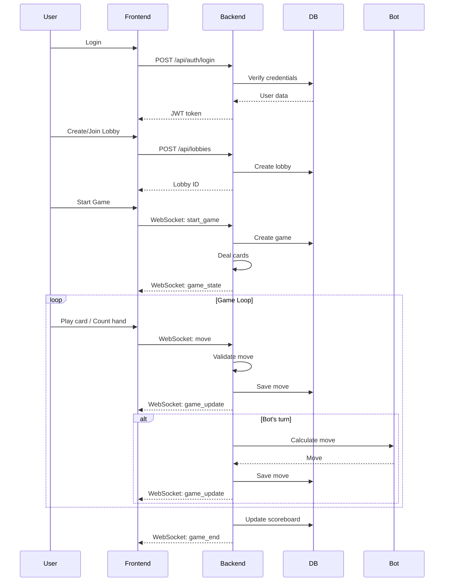

# Cribbage Multi-Player Game Platform

## Architecture Overview

The application will consist of:

- **Backend**: Go with Gin framework, WebSocket support, SQLite database
- **Frontend**: React with TypeScript, real-time UI updates via WebSockets
- **Database**: SQLite for local storage (users, games, scores, lobbies)
- **Real-time**: WebSocket connections for live gameplay
- **Deployment**: ngrok for external access

## Project Structure

```javascript
fifteen-thirty-one-go/
├── backend/
│   ├── cmd/
│   │   └── server/
│   │       └── main.go
│   ├── internal/
│   │   ├── auth/
│   │   │   ├── jwt.go
│   │   │   └── password.go
│   │   ├── database/
│   │   │   ├── migrations/
│   │   │   └── db.go
│   │   ├── game/
│   │   │   ├── interface.go (Game interface for extensibility)
│   │   │   ├── registry.go (Game type registry)
│   │   │   ├── cribbage/
│   │   │   │   ├── cribbage.go
│   │   │   │   ├── scoring.go
│   │   │   │   ├── bot.go
│   │   │   │   └── rules.go
│   │   │   └── common/
│   │   │       ├── deck.go
│   │   │       └── cards.go
│   │   ├── handlers/
│   │   │   ├── auth.go
│   │   │   ├── game.go
│   │   │   ├── lobby.go
│   │   │   ├── websocket.go
│   │   │   └── scoreboard.go
│   │   ├── models/
│   │   │   ├── user.go
│   │   │   ├── game.go
│   │   │   ├── lobby.go
│   │   │   └── score.go
│   │   └── middleware/
│   │       └── auth.go
│   ├── pkg/
│   │   └── websocket/
│   │       └── hub.go
│   └── go.mod
├── frontend/
│   ├── src/
│   │   ├── components/
│   │   │   ├── Login.tsx
│   │   │   ├── Register.tsx
│   │   │   ├── LobbyList.tsx
│   │   │   ├── GameBoard.tsx
│   │   │   ├── Card.tsx
│   │   │   ├── Hand.tsx
│   │   │   ├── ScoringPanel.tsx
│   │   │   └── Scoreboard.tsx
│   │   ├── hooks/
│   │   │   ├── useWebSocket.ts
│   │   │   └── useAuth.ts
│   │   ├── services/
│   │   │   ├── api.ts
│   │   │   └── websocket.ts
│   │   ├── store/
│   │   │   └── gameStore.ts
│   │   ├── App.tsx
│   │   └── main.tsx
│   ├── package.json
│   └── vite.config.ts
├── docker-compose.yml (optional, for ngrok)
├── README.md
└── .gitignore
```


## Database Schema

**users**

- id (INTEGER PRIMARY KEY)
- username (TEXT UNIQUE)
- password_hash (TEXT)
- created_at (TIMESTAMP)
- games_played (INTEGER)
- games_won (INTEGER)

**lobbies**

- id (INTEGER PRIMARY KEY)
- name (TEXT)
- host_id (INTEGER, FK to users)
- max_players (INTEGER, 2-4)
- current_players (INTEGER)
- status (TEXT: 'waiting', 'in_progress', 'finished')
- created_at (TIMESTAMP)

**games**

- id (INTEGER PRIMARY KEY)
- lobby_id (INTEGER, FK to lobbies)
- status (TEXT: 'waiting', 'playing', 'finished')
- current_player_id (INTEGER, FK to users)
- dealer_id (INTEGER, FK to users)
- created_at (TIMESTAMP)
- finished_at (TIMESTAMP)

**game_players**

- game_id (INTEGER, FK to games)
- user_id (INTEGER, FK to users)
- position (INTEGER, 0-3)
- score (INTEGER, default 0)
- hand (TEXT, JSON array of cards)
- crib_cards (TEXT, JSON array, nullable)
- is_bot (BOOLEAN, default false)
- bot_difficulty (TEXT, nullable)

**game_moves**

- id (INTEGER PRIMARY KEY)
- game_id (INTEGER, FK to games)
- player_id (INTEGER, FK to users)
- move_type (TEXT: 'play_card', 'discard', 'count_hand', 'count_crib', 'pegging')
- card_played (TEXT, nullable)
- score_claimed (INTEGER, nullable)
- score_verified (INTEGER, nullable)
- is_corrected (BOOLEAN, default false)
- created_at (TIMESTAMP)

**scoreboard**

- id (INTEGER PRIMARY KEY)
- user_id (INTEGER, FK to users)
- game_id (INTEGER, FK to games)
- final_score (INTEGER)
- position (INTEGER)
- created_at (TIMESTAMP)

## Implementation Plan

### Phase 1: Backend Foundation

1. **Project Setup**

- Initialize Go module with Gin, WebSocket, SQLite dependencies
- Set up project structure
- Create database connection and migration system

2. **Authentication System** ([backend/internal/auth/](backend/internal/auth/))

- JWT token generation and validation
- Password hashing (bcrypt)
- User registration and login endpoints
- Auth middleware for protected routes

3. **Database Models** ([backend/internal/models/](backend/internal/models/))

- User, Game, Lobby, Score models
- Database migrations for schema creation
- CRUD operations

### Phase 2: Game Logic

4. **Cribbage Game Engine** ([backend/internal/game/](backend/internal/game/))

- Card deck representation and shuffling
- Hand dealing logic
- Cribbage scoring engine:
    - 15s, pairs, runs, flushes, nobs
    - Hand counting (6 cards)
    - Crib counting (4 cards + cut card)
    - Pegging scoring (31, pairs, runs, 15)
- Game state management
- Turn progression logic
- Win condition checking (121 points)

5. **Bot AI** ([backend/internal/game/bot.go](backend/internal/game/bot.go))

- Easy: Random valid moves
- Medium: Basic strategy (prefer high cards, avoid giving points)
- Hard: Advanced strategy (card counting, optimal discards, pegging strategy)

6. **Game Rules** ([backend/internal/game/rules.go](backend/internal/game/rules.go))

- Support 2, 3, and 4 player variations
- Dealer rotation
- Crib assignment rules

### Phase 3: API Endpoints

7. **REST API Handlers** ([backend/internal/handlers/](backend/internal/handlers/))

- `POST /api/auth/register` - User registration
- `POST /api/auth/login` - User login
- `GET /api/lobbies` - List available lobbies
- `POST /api/lobbies` - Create lobby
- `POST /api/lobbies/:id/join` - Join lobby
- `GET /api/games/:id` - Get game state
- `POST /api/games/:id/move` - Make game move
- `POST /api/games/:id/count` - Submit hand/crib count
- `POST /api/games/:id/correct` - Correct a count
- `GET /api/scoreboard` - Get global scoreboard
- `GET /api/scoreboard/:userId` - Get user stats

### Phase 4: WebSocket System

8. **Real-time Communication** ([backend/pkg/websocket/](backend/pkg/websocket/))

- WebSocket hub for managing connections
- Room-based messaging (per game/lobby)
- Message types:
    - Game state updates
    - Player actions
    - Count submissions
    - Turn changes
    - Game end notifications

9. **WebSocket Handler** ([backend/internal/handlers/websocket.go](backend/internal/handlers/websocket.go))

- Connection upgrade endpoint
- Client registration
- Message routing to game engine

### Phase 5: Scoring Features

10. **Auto-Count System** ([backend/internal/game/scoring.go](backend/internal/game/scoring.go))

    - Automatic calculation of hand/crib scores
    - Suggestion mode: Calculate and suggest, require confirmation
    - Auto-apply mode: Automatically apply calculated scores
    - User preference storage

11. **Manual Count & Correction** ([backend/internal/handlers/game.go](backend/internal/handlers/game.go))

    - Allow players to manually enter counts
    - Count correction system:
    - Players can edit their count before finalizing
    - After finalizing, corrections require game admin approval
    - Correction history tracking
    - Count verification against calculated score

### Phase 6: Frontend Foundation

12. **React Setup**

    - Initialize React + TypeScript + Vite project
    - Set up routing (React Router)
    - Configure API client and WebSocket connection
    - Create authentication context/store

13. **UI Components**

    - Login/Register forms
    - Lobby list and creation
    - Game board with card visualization
    - Hand display with drag-and-drop
    - Scoring panel with auto/manual modes
    - Scoreboard display

### Phase 7: Frontend Game Features

14. **Game Interface** ([frontend/src/components/GameBoard.tsx](frontend/src/components/GameBoard.tsx))

    - Real-time game state display
    - Card playing interface
    - Pegging board visualization
    - Turn indicators
    - Score displays

15. **Scoring Interface** ([frontend/src/components/ScoringPanel.tsx](frontend/src/components/ScoringPanel.tsx))

    - Auto-count toggle
    - Manual count input
    - Count correction UI
    - Score breakdown display (15s, pairs, runs, etc.)

### Phase 8: Additional Features

16. **Lobby System** ([frontend/src/components/LobbyList.tsx](frontend/src/components/LobbyList.tsx))

    - Browse available lobbies
    - Create new lobbies
    - Join/leave lobbies
    - Bot selection and difficulty

17. **Scoreboard** ([frontend/src/components/Scoreboard.tsx](frontend/src/components/Scoreboard.tsx))

    - Global leaderboard
    - User statistics
    - Game history

### Phase 9: Polish & Deployment

18. **Error Handling & Validation**

    - Input validation
    - Error messages
    - Game state validation

19. **ngrok Setup**

    - Configuration for exposing local server
    - Instructions for setup

20. **Documentation**

    - README with setup instructions
    - API documentation
    - Game rules reference

## Key Technical Decisions

- **WebSocket Library**: Use `github.com/gorilla/websocket` for Go backend
- **JWT**: Use `github.com/golang-jwt/jwt/v5` for authentication
- **Database**: `github.com/mattn/go-sqlite3` for SQLite driver
- **Frontend State**: TanStack React Query for API state management, WebSocket for real-time game state
- **Card Rendering**: SVG or image-based card components
- **Real-time Updates**: WebSocket messages trigger React state updates

## Game Flow




## Dependencies

**Backend (go.mod)**

- github.com/gin-gonic/gin
- github.com/gorilla/websocket
- github.com/golang-jwt/jwt/v5
- github.com/mattn/go-sqlite3
- golang.org/x/crypto (bcrypt)

**Frontend (package.json)**

- react, react-dom
- react-router-dom
- typescript